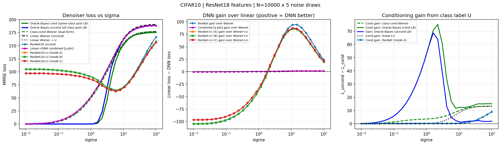

# MMSE Denoiser Loss: Methods and Math

This document describes the math and code used to compute each curve in the DNN feature MMSE experiment (`scripts/dnn_feature_mmse.py`).

**Setup.** We observe a noisy image $y = x_0 + \sigma Z$ where $x_0 \sim p_0$ (CIFAR-10, $d = 3072$), $Z \sim \mathcal{N}(0, I)$, and optionally a class label $U \in \{1,\ldots,C\}$ (one-hot, $C=10$). The optimal linear denoiser loss for feature vector $\phi(y)$ is

$$L = \operatorname{Tr}(\Sigma_{x_0}) - \operatorname{Tr}\!\left(\operatorname{Cov}(x_0, \phi)\,\Sigma_\phi^{-1}\,\operatorname{Cov}(\phi, x_0)\right)$$

This is the residual MSE after the best linear prediction of $x_0$ from $\phi$.

---

## 1. Unconditional Linear Wiener Filter (`linear_uncond`)

**Math.** The optimal linear denoiser using $\phi(y) = y$ has closed-form loss via the eigenvalues $\{\lambda_i\}$ of $\Sigma_{x_0}$:

$$L_{\text{uncond}} = \sum_i \frac{\sigma^2 \lambda_i}{\lambda_i + \sigma^2}$$

At $\sigma \to \infty$: $L_{\text{uncond}} \to \operatorname{Tr}(\Sigma_{x_0})$ (total variance, $\approx 191$ for CIFAR-10).
At $\sigma \to 0$: $L_{\text{uncond}} \to 0$.

**Code.** `wiener_gpu(x0, sigma)` — computes $\Sigma_{x_0}$ via `torch.linalg.eigh`, then applies the formula above. Fully analytic, always non-negative.

---

## 2. Conditional Linear Wiener Filter with Class Label (`linear_cond`)

**Math.** Feature $\phi(y, U) = [y;\, U]$. The optimal linear model is $\hat{x}_0 = a + Ay + BU$ with a **shared slope** $A$ and class-specific bias $BU$.

The analytic loss uses the joint covariance of $[y; U]$:

$$\Sigma_{[y,U]} = \begin{bmatrix} \Sigma_{x_0} + \sigma^2 I & C_{xU} \\ C_{xU}^\top & \Sigma_U \end{bmatrix}$$

where $C_{xU} = \operatorname{Cov}(x_0, U)$ encodes class-conditional means. The explained variance is

$$\operatorname{explained} = \operatorname{Tr}\!\left([\Sigma_{x_0},\, C_{xU}]\; \Sigma_{[y,U]}^{-1}\; [\Sigma_{x_0};\, C_{xU}^\top]\right)$$

Using the **Schur complement** of $\Sigma_y = \Sigma_{x_0} + \sigma^2 I$ (reducing a $3082\times3082$ inversion to $10\times10$):

$$L_{\text{cond}} = L_{\text{uncond}} - \operatorname{Tr}(Q \cdot S^{-1})$$

where

$$Q_{ij} = \sum_k \frac{\sigma^4}{(\lambda_k + \sigma^2)^2}\, (V^\top C_{xU})_{ki}\,(V^\top C_{xU})_{kj}$$

$$S = \Sigma_U - \sum_k \frac{1}{\lambda_k + \sigma^2}\,(V^\top C_{xU})_{k\cdot}^\top (V^\top C_{xU})_{k\cdot}$$

with $V$ the eigenvectors of $\Sigma_{x_0}$, and $S$ is the $10\times10$ Schur complement (always PSD).
The correction $\operatorname{Tr}(Q S^{-1}) \ge 0$, so $L_{\text{cond}} \le L_{\text{uncond}}$.

At $\sigma \to \infty$: $L_{\text{cond}} \to \operatorname{Tr}(\Sigma_{x_0}) - \operatorname{Tr}(C_{xU} \Sigma_U^{-1} C_{xU}^\top) = \text{within-class variance}$.

**Code.** `wiener_linear_u_precompute(x0, U)` — computes $V$, $V^\top C_{xU}$, $\Sigma_U$ once.
`wiener_linear_u_loss(precomp, sigma)` — evaluates $Q$, $S$, and the trace correction per $\sigma$. Analytic, always non-negative, $O(d \cdot C^2)$ per $\sigma$ after precomputation.

**Key difference from `wiener_class_cond`:** The shared slope $A$ is less expressive than per-class slopes $A^c$, so $L_{\text{cond}} \ge L_{\text{wiener\_class\_cond}}$. Both converge to within-class variance as $\sigma \to \infty$.

---

## 3. Class-Conditional Wiener Filter (`wiener_class_cond`)

**Math.** For each class $c$, the optimal linear denoiser using $y$ alone (given class label $c$) is

$$L_c = \sum_i \frac{\sigma^2 \lambda_i^c}{\lambda_i^c + \sigma^2}$$

where $\{\lambda_i^c\}$ are eigenvalues of the **within-class covariance** $\Sigma_c = \operatorname{Cov}(x_0 \mid \text{class}=c)$.
The total loss is the class-frequency-weighted average:

$$L_{\text{wiener\_class\_cond}} = \sum_c \frac{N_c}{N} L_c$$

This uses **per-class slopes** $A^c = \Sigma_c (\Sigma_c + \sigma^2 I)^{-1}$, making it strictly more expressive than `linear_cond`.

At $\sigma \to \infty$: $L_c \to \operatorname{Tr}(\Sigma_c)$, so $L_{\text{wiener\_class\_cond}} \to \text{within-class variance} \approx 177$.

**Code.** `wiener_class_cond_gpu(x0, labels, sigma, n_classes)` — loops over classes, calls `wiener_gpu(x0_c, sigma)` per class (eigendecomposition of $\Sigma_c$), weighted average. Analytic, always non-negative.

---

## 4. Oracle Conditional Bayes (`bayes_cond`) — Lower Bound on Class-Cond MMSE

**Math.** Uses the **exact nonlinear** Bayes posterior mean:

$$\hat{x}_0^{\text{Bayes}}(y, c) = \sum_{j:\,\text{class}(j)=c} w_j\, x_0^{(j)}, \quad w_j = \frac{\exp\!\left(-\|y - x_0^{(j)}\|^2 / 2\sigma^2\right)}{\sum_{j'} \exp(\cdots)}$$

The pool is the **same** $N$ training samples used for evaluation (self-inclusive). This makes it an **oracle lower bound**: at low $\sigma$, each $y \approx x_0$ matches itself exactly, giving MSE $\to 0$. At high $\sigma$, the softmax weights become uniform over the class, giving MSE $\to \operatorname{Tr}(\Sigma_c) = \text{within-class variance}$.

This lower-bounds the class-conditional MMSE $\mathbb{E}[\|x_0 - \mathbb{E}[x_0 \mid y, U]\|^2]$ because: (i) it uses the true empirical distribution (finite-sample oracle), (ii) it uses the optimal nonlinear estimator, (iii) class-restriction is correct.

At $\sigma \to \infty$: $L_{\text{bayes\_cond}} \to \text{within-class variance}$ (same as `wiener_class_cond`).

**Code.** `bayes_optimal_loss(x0_pool, pool_labels, x0_eval, eval_labels, sigma, conditional=True)` — for each class $c$, computes $(N_{\text{eval},c} \times N_{\text{pool},c})$ squared-distance matrix, applies softmax, computes MSE. Chunks evaluation to avoid OOM.

---

## 5. Oracle Unconditional Bayes (`bayes_uncond`) — Lower Bound on Uncond MMSE

**Math.** Same as `bayes_cond` but the pool contains **all** $N$ training samples (no class restriction):

$$\hat{x}_0^{\text{Bayes}}(y) = \sum_{j=1}^N w_j\, x_0^{(j)}, \quad w_j \propto \exp\!\left(-\|y - x_0^{(j)}\|^2 / 2\sigma^2\right)$$

Self-inclusive oracle lower bound on the unconditional MMSE $\mathbb{E}[\|x_0 - \mathbb{E}[x_0 \mid y]\|^2]$.

At $\sigma \to \infty$: weights become uniform over all $N$ samples $\Rightarrow$ MSE $\to \operatorname{Tr}(\Sigma_{x_0}) = \text{total variance} \approx 191$.

**Code.** `bayes_optimal_loss(..., conditional=False)` — chunk-based softmax over full pool, no class split.

---

## 6. Combined Linear + DNN Features (`linear_plus_dnn`)

**Math.** Feature vector $\phi(y) = [y;\, \phi_{\text{enc}}(y)]$ — concatenation of raw pixels and ResNet18 features. The best linear predictor of $x_0$ from this joint feature achieves loss:

$$L_{\text{combined}} = L_{\text{uncond}} - \underbrace{\operatorname{Tr}\!\left(Q\, S^{-1}\right)}_{\text{DNN gain given }y}$$

where the **DNN gain** is computed via the Schur complement of $\Sigma_y$ in the joint covariance of $[y;\, \phi_{\text{enc}}(y)]$. Specifically, let $V$ be the eigenvectors of $\Sigma_{x_0}$ and define:

$$C_{\text{part},ij} = \frac{1}{N}\sum_n (x_{0,n} - \bar{x}_0)_i\,(\phi_n - \bar\phi)_j - \sum_k \frac{\lambda_k}{\lambda_k+\sigma^2}\,(V^\top)_{ki}\,(V^\top C_{x_0,\phi})_{kj}$$

This is the **partial cross-covariance** of $x_0$ and $\phi_{\text{enc}}$ after projecting out the component already explained by $y$ (via the Wiener filter). Then:

$$Q = C_{\text{part}}^\top C_{\text{part}}, \qquad S = \hat\Sigma_\phi - (V \operatorname{diag}(\tfrac{\lambda}{\lambda+\sigma^2}) V^\top)\, C_{x_0,\phi} - C_{x_0,\phi}^\top\, (V \operatorname{diag}(\tfrac{\lambda}{\lambda+\sigma^2}) V^\top) + C_{x_0,\phi}^\top \Sigma_y^{-1} C_{x_0,\phi}$$

where $S$ is the Schur complement of $\Sigma_y$ in the joint covariance $\Sigma_{[y,\phi]}$ (a $k\times k = 512\times 512$ system, never requiring a $d\times d$ inversion).

The gain $\operatorname{Tr}(Q S^{-1}) \ge 0$ always, so $L_{\text{combined}} \le L_{\text{uncond}}$.

**Noise model.** Noise is added at 32×32 pixel resolution (same as Oracle Bayes), then the noisy image is resized and normalized for the encoder — ensuring $\sigma$ is directly comparable across all curves.

**Asymptotic limits.**
- $\sigma \to 0$: $L_{\text{combined}} \to 0$ (perfect reconstruction from clean pixels $y \approx x_0$).
- $\sigma \to \infty$: gain $\to 0$ (noisy features become uninformative), $L_{\text{combined}} \to L_{\text{uncond}} \to \operatorname{Tr}(\Sigma_{x_0})$.

**Code.** `extract_combined_stats(encoder, x0_small, sigma, n_noise, batch_size)` — accumulates sufficient statistics $(\hat\Sigma_\phi,\, C_{x_0,\phi},\, C_{y,\phi})$ over $n_{\text{noise}}$ draws without materialising the full matrix. `mmse_combined_schur(stats, x0_small, eigvals, eigvecs, sigma)` — computes the Schur complement and returns `loss`.

---

## 7. ResNet18 Unconditional Features (`resnet_uncond`)

**Math.** Encoder $\phi_{\text{enc}}: y \mapsto \mathbb{R}^{512}$ (ResNet18 penultimate layer, ImageNet pretrained). The loss is estimated as the in-sample regression loss:

$$L_{\text{ResNet}} = \operatorname{Tr}(\Sigma_{x_0}) - \operatorname{Tr}\!\left(\hat{C}_{x_0,\phi}\, (\hat{\Sigma}_\phi + \lambda I)^{-1}\, \hat{C}_{\phi,x_0}\right)$$

where $\hat{\Sigma}_\phi$, $\hat{C}_{x_0,\phi}$ are sample estimates from $N \times n_{\text{noise}} = 50{,}000$ pairs $(y_i, x_{0,i})$ with fresh noise per draw.

**Code.** `extract_and_repeat(encoder, x0_enc, sigma, n_noise)` — runs the ResNet18 on GPU with noise added in fp16. `mmse_gpu(Phi, X0_rep, lam)` — primal form (k=512 < N=50k) returns `loss`.

---

## 7. ResNet18 Conditional Features (`resnet_cond_A/B/C`)

**Math.** Three strategies for building $\phi^U(y, U)$:

| Mode | Feature vector | Dim |
|------|---------------|-----|
| A | $[\phi_{\text{enc}}(y);\; U]$ | $512 + 10$ |
| B | $[\phi_{\text{enc}}(y);\; \omega(\Gamma U + b)]$ | $512 + k_U$, random $\Gamma$ |
| C | $[\phi_{\text{enc}}(y);\; \Gamma U;\; \phi_{\text{enc}}(y) \odot (WU)]$ | $512 + k_U + 512$ |

Mode A: direct concatenation of raw one-hot $U$.
Mode B: random nonlinear projection of $U$ (width $k_U = 64$, fixed random $\Gamma$).
Mode C: Mode B linear part + FiLM-style multiplicative interaction $\phi \odot WU$.

Loss estimated via the same in-sample regression formula as `resnet_uncond`.

**Code.** `build_conditional_features(Phi, U, mode)` in `core/dnn_estimator.py`. Then `mmse_gpu(Phi_cond, X0_rep, lam)`.

---

## Summary Table

| Curve | Estimator class | Formula type | Always non-negative? | $\sigma \to \infty$ limit |
|-------|----------------|-------------|---------------------|--------------------------|
| `linear_uncond` | Global linear $\hat{x} = Ay$ | Analytic eigdecomp | Yes | Total var $\approx 191$ |
| `linear_cond` | Linear $\hat{x} = Ay + BU$ | Analytic Schur complement | Yes | Within-class var $\approx 177$ |
| `wiener_class_cond` | Per-class linear $\hat{x} = A^c y + b^c$ | Analytic eigdecomp per class | Yes | Within-class var $\approx 177$ |
| `bayes_cond` | Exact nonlinear, same-class pool | Softmax kernel regression | Yes | Within-class var $\approx 177$ |
| `bayes_uncond` | Exact nonlinear, full pool | Softmax kernel regression | Yes | Total var $\approx 191$ |
| `linear_plus_dnn` | Linear readout from $[y;\,\phi_{\text{enc}}(y)]$ | Analytic Schur complement | Yes | Total var $\approx 191$ |
| `resnet_uncond` | Linear readout from ResNet18 features only | In-sample regression | Approx (lam) | $\approx$ Total var |
| `resnet_cond_A/B/C` | Linear readout from ResNet18 + $U$ | In-sample regression | Approx (lam) | $\approx$ Within-class var |

Inequalities at all $\sigma$ (analytic curves):
$$L_{\text{bayes\_cond}} \le L_{\text{wiener\_class\_cond}} \le L_{\text{linear\_cond}} \le L_{\text{linear\_uncond}}$$
$$L_{\text{bayes\_uncond}} \le L_{\text{linear\_uncond}}$$
$$L_{\text{linear\_plus\_dnn}} \le L_{\text{linear\_uncond}}$$

---

## Result Figure

*CIFAR-10, N=10,000 samples, ResNet18 (ImageNet pretrained), $\sigma \in [0.01, 100]$.*
