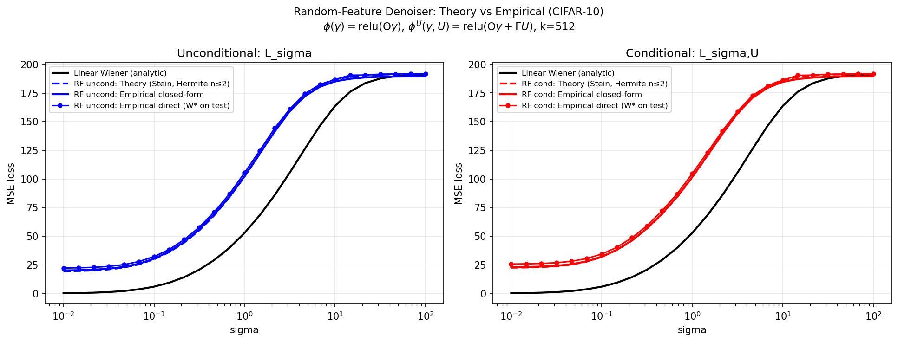

# Random-Feature Denoiser: Methods for Computing $\mathcal{L}_\sigma$

This document explains the three methods used in `scripts/rf_theory_vs_empirical.py` to compute the MMSE loss for the random-feature denoiser.

**Full derivation by Michimin:** see [`newfile2.tex`](newfile2.tex) / [`newfile2_article.pdf`](newfile2_article.pdf).

---

## Setup

**Feature map.** $\phi(y) = \mathrm{relu}(\Theta y)$, where $\Theta \in \mathbb{R}^{k \times d}$ is a fixed random matrix (Gaussian entries, scaled by $1/\sqrt{d}$). No learning of $\Theta$.

**Denoiser.** Linear readout on top of the fixed features:
$$D_\theta(\phi(y)) = W_\sigma \phi(y) + b_\sigma$$

**Loss.** Expected MSE over $x_0 \sim p_0$ (CIFAR-10) and $Z \sim \mathcal{N}(0,I)$:
$$\mathcal{L}_\sigma = \mathbb{E}\bigl\|W_\sigma \phi(x_0 + \sigma Z) + b_\sigma - x_0\bigr\|^2$$

**Optimal weights** (derived in newfile2.tex, Section 1):
$$W^*_\sigma = \mathrm{Cov}(x_0,\, \phi)\; \Sigma_\phi^{-1}, \qquad b^*_\sigma = \mu_{p_0} - W^*_\sigma \mu_\phi$$

**Minimal loss** (plugging $W^*$ back in):
$$\mathcal{L}_\sigma = \mathrm{Tr}(\Sigma_{p_0}) - \mathrm{Tr}\!\bigl(\mathrm{Cov}(x_0,\phi)\;\Sigma_\phi^{-1}\;\mathrm{Cov}(\phi, x_0)\bigr)$$

All three methods below compute this same quantity — they differ in how $\mathrm{Cov}(x_0,\phi)$ and $\Sigma_\phi$ are obtained.

---

## Method 1 — Empirical Closed-Form (`rf_*_empirical_cf`)

**What it does.** Estimates $\mathrm{Cov}(x_0,\phi)$ and $\Sigma_\phi$ directly from data, plugs into the trace formula above. $W^*$ is never explicitly formed.

**How.** For each $\sigma$, draw $n_\text{noise}=5$ noise realizations per training image ($N=10{,}000$), giving $N \times n_\text{noise} = 50{,}000$ pairs $(y_i, x_{0,i})$:

$$\hat\Sigma_\phi = \frac{1}{N-1}\sum_i (\phi_i - \bar\phi)(\phi_i - \bar\phi)^\top + \lambda I$$
$$\widehat{\mathrm{Cov}}(x_0,\phi) = \frac{1}{N-1}\sum_i (x_{0,i} - \bar x_0)(\phi_i - \bar\phi)^\top$$
$$L = \mathrm{Tr}(\hat\Sigma_{p_0}) - \mathrm{Tr}\!\bigl(\widehat{\mathrm{Cov}}(x_0,\phi)\;\hat\Sigma_\phi^{-1}\;\widehat{\mathrm{Cov}}(\phi, x_0)\bigr)$$

**Key property.** Evaluation uses the same dataset used to estimate the covariances (in-sample). This tends to slightly *underestimate* the true loss (optimistic bias from finite samples).

---

## Method 2 — Empirical Direct (`rf_*_empirical_dir`)

**What it does.** Explicitly computes $W^*$ and $b^*$ from training data, then evaluates the MSE on a *held-out test set* (5,000 CIFAR-10 test images).

**How.**

1. From training data: $W^* = \widehat{\mathrm{Cov}}(x_0,\phi)\;\hat\Sigma_\phi^{-1}$, $b^* = \bar x_0 - W^* \bar\phi$
2. Draw one fresh noise realization for each test image: $y_\text{test} = x_{0,\text{test}} + \sigma Z$
3. Evaluate: $L = \frac{1}{N_\text{test}}\sum_n \|W^* \phi(y_n) + b^* - x_{0,n}\|^2$

**Key property.** Out-of-sample evaluation — avoids the in-sample optimism of Method 1. In practice slightly *higher* than Method 1 (train/test gap). As $N \to \infty$ both converge to the true $\mathcal{L}_\sigma$.

---

## Method 3 — Theory: Empirical $p_0$ + Hermite for Noise (`rf_*_theory`)

**What it does.** Computes $\mathrm{Cov}(x_0,\phi)$ and $\Sigma_\phi$ using the *actual* data distribution for all $x_0$ expectations, and the Hermite expansion only for the Gaussian noise $Z$ (which is exact since $Z$ is Gaussian). No assumption is made on $p_0$. See newfile2.tex, Sections 1–2.

**Key idea.** For each feature $j$, the noise $Z$ enters only through the scalar $\xi = \theta_j^\top Z / \|\theta_j\| \sim \mathcal{N}(0,1)$, turning the $d$-dimensional noise integral into a 1D Gaussian integral:

$$\phi_j(x_0 + \sigma Z) = \mathrm{relu}(\underbrace{\theta_j^\top x_0}_{M_j(x_0)} + \underbrace{\sigma\|\theta_j\|}_{s_j}\,\xi)$$

The expected feature value given $x_0$ (Gaussian-smoothed ReLU, computable analytically):
$$g_j(x_0) = \mathbb{E}_Z[\phi_j(x_0 + \sigma Z)] = M_j\,\Phi(z_j) + s_j\,\varphi(z_j), \quad z_j = M_j / s_j$$

**Formulas.** Hermite coefficients for ReLU (coefficients of the noise expansion):
$$c_1(M_j, s_j) = s_j\,\Phi(z_j), \qquad c_2(M_j, s_j) = \tfrac{s_j\,\varphi(z_j)}{2}$$

**Covariance** — sample average over the actual data, no Gaussian assumption:
$$\mathrm{Cov}(x_0,\phi)_{ij} = \frac{1}{N}\sum_n (x_{0,i}^{(n)} - \bar x_0)\,g_j(x_0^{(n)})$$

In matrix form with $G \in \mathbb{R}^{N\times k}$ where $G_{nj} = g_j(x_0^{(n)})$:
$$\widehat{\mathrm{Cov}}(x_0, \phi) = \frac{1}{N} X_0^{c\top} G^c$$

**Feature covariance** — variance decomposition (data part + noise part):
$$\Sigma_\phi = \underbrace{\frac{1}{N}G^{c\top}G^c}_{\mathrm{Cov}_{x_0}(g_i, g_j)} + \underbrace{\rho \odot \frac{C_1^\top C_1}{N} + 2\rho^2 \odot \frac{C_2^\top C_2}{N}}_{\text{noise part: Hermite }n=1,2}$$

where $\rho_{ij} = \sigma^2\,\theta_i^\top\theta_j / (s_i s_j)$ is the **noise-only** pre-activation correlation (from $Z$ only, not $x_0$), and $C_1, C_2 \in \mathbb{R}^{N\times k}$ are sample matrices of $c_1, c_2$ evaluated at each $x_0^{(n)}$.

**Key property.** No Gaussian assumption on $p_0$. The Hermite expansion applies only to the noise $Z$ (which IS Gaussian — exact). The data variation of $g_j$ across the actual distribution is captured in $\mathrm{Cov}_{x_0}(G)$. Validated to closely match empirical estimates (~102.26 vs 102.45 at $\sigma=1.0$).

---

## Conditional Version (`rf_cond_*`)

The conditional feature map is $\phi^U(y, U) = \mathrm{relu}(\Theta y + \Gamma U)$ where $U$ is the one-hot class label and $\Gamma \in \mathbb{R}^{k \times C}$ is fixed random.

The empirical methods (1 & 2) apply without change — just replace $\phi(y)$ with $\phi^U(y,U)$.

For the theory (Method 3), the same variance decomposition applies. The pre-activation mean per sample becomes:
$$M^U_j(x_0, U) = \theta_j^\top x_0 + \gamma_j^\top U$$

with the noise std $s_j = \sigma\|\theta_j\|$ unchanged (noise enters only through $\theta_j^\top \sigma Z$). The Gaussian-smoothed feature is:
$$g^U_j(x_0, U) = M^U_j\,\Phi(z^U_j) + s_j\,\varphi(z^U_j), \quad z^U_j = M^U_j / s_j$$

and $\mathrm{Cov}(x_0, \phi^U)$, $\Sigma^U_\phi$ are computed via the same formula as the unconditional case, with $G_{nj} = g^U_j(x_0^{(n)}, U^{(n)})$ computed over the joint $(x_0, U)$ training distribution. No Gaussian assumption on $(x_0, U)$.

---

## Results Figure

*CIFAR-10, $N_\text{train}=10{,}000$, $k=512$ ReLU features, $\sigma \in [0.01, 50]$.*

**Main finding:** Theory closely tracks empirical at all $\sigma$, validating the Stein/Hermite approximation. Random features relu($\Theta y$) are substantially worse than linear Wiener (e.g. 86 vs 41 at $\sigma=0.71$) because random projection $d=3072 \to k=512$ discards most pixel information.
